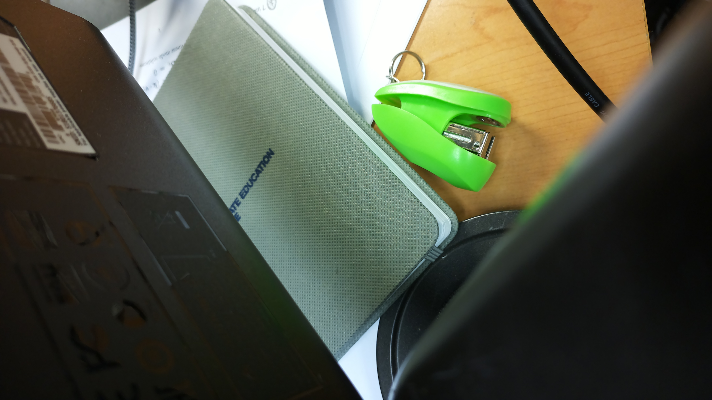

- Configuring a 2nd ip on MAC
	`ifconfig en6 alias 10.42.0.XX/24 up`
- Remove interface add a `-alias`
- v3 mac: `b8:27:eb:ce:b8:86` (get this a static)

## Raspi commands

-  Setting date
		`date -s "DD/MM/YYYY HH:MM:SS EST"`
- configuration for opencv

### Optical camera

- Test information with resolution 

Test images

